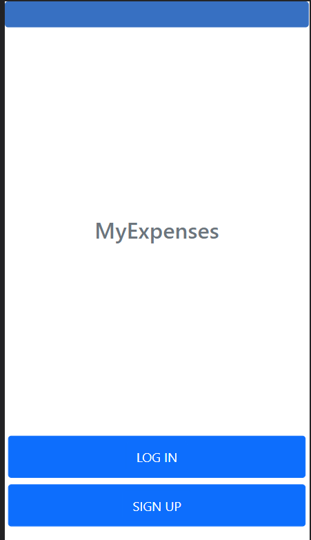
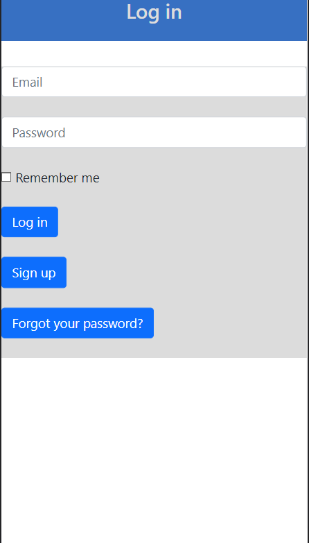
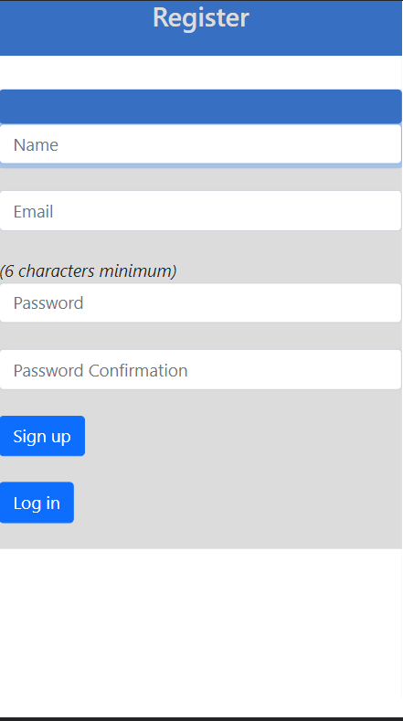
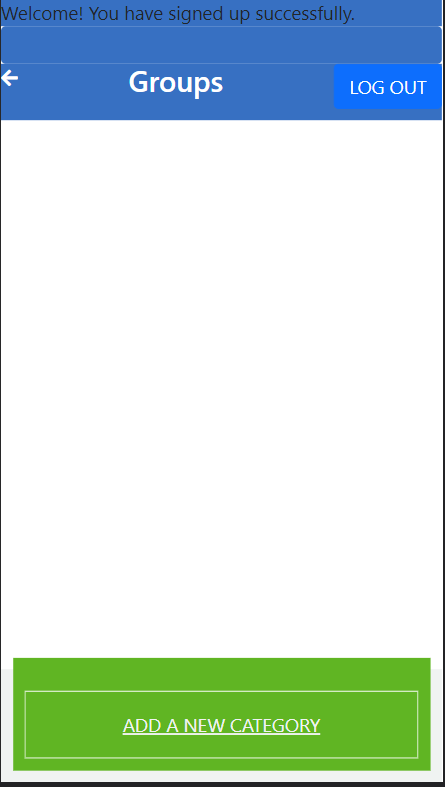
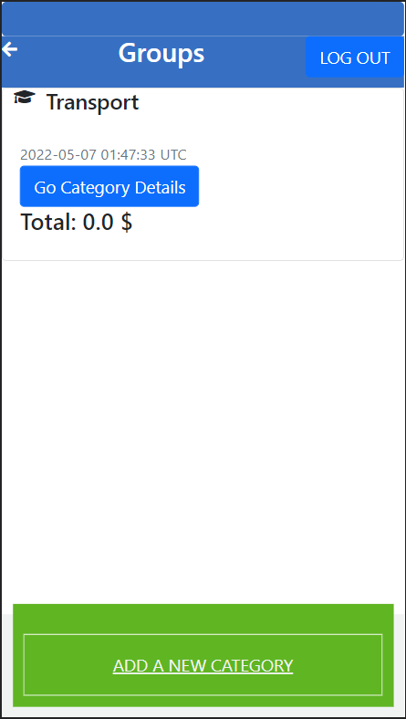
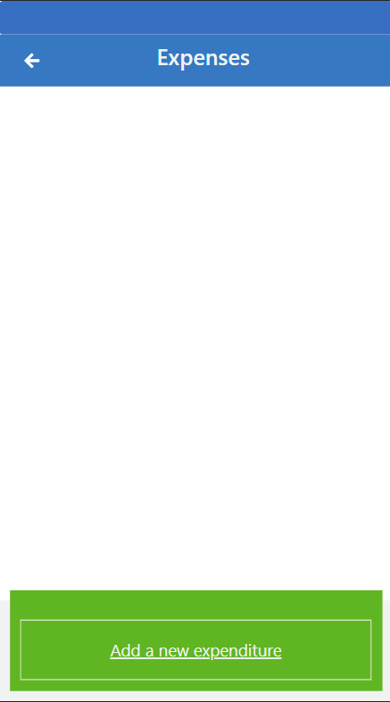
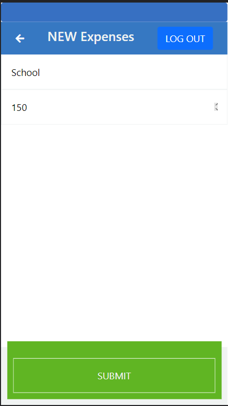
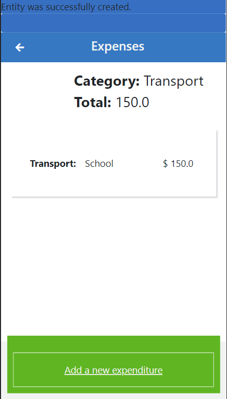

# Budget mobile app

> Ruby or Rails capstone project
# Description
The Ruby on Rails capstone project is about building a mobile web application where you can manage your budget: you have a list of transactions associated with a category, so that you can see how much money you spent and on what.

You will create a Ruby on Rails application that allows the user to:

register and log in, so that the data is private to them.
introduce new transactions associated with a category.
see the money spent on each category.

# Demo Link
[Click here](https://myexpenses11.herokuapp.com)
# Loom Video
[Click here](https://www.loom.com/share/e621a6f3e14e4636ac38eba0790f8ec7)

# Screenshot

# Getting Started

To get a local copy up and running follow these simple steps.

- You can clone this repo by typing `git clone https://github.com/AtillaTahak/my-expenses` on your terminal.

- Type `cd my-expenses` to access the project on the terminal.
  
- Run `bundle install` from your editor's terminal.

- Run `rails s` from your editor's terminal.

- Run `rubocop` . to check for HTML Linter errors.

# This project was built with:

Languages: Ruby

Framework: Ruby on Rails

Database: PostgreSQL

icon and css framework : fontawesome  and bootstrap

# Version Control System

GIT

# 👤 Authors

👤 **ATİLLA TAHA KÖRDÜĞÜM**

- GitHub: [@AtillaTahak](https://github.com/AtillaTahak)
- Twitter: [@AtillaTahaa](https://twitter.com/AtillaTahaa)
- LinkedIn: [LinkedIn](https://www.linkedin.com/in/atilla-taha-kördüğüm-a93702186/)
- Blog: [Blog](atillataha.blogspot.com)
- Youtube: [YouTube](https://www.youtube.com/channel/UCmoD0x4Z9vdG2PCsI5p8FYg)

# 🤝 Contributing

Contributions, issues, and feature requests are welcome!

Feel free to check the [issues page](https://github.com/AtillaTahak/space-travelers/issues).

# Show your support

Give a ⭐️ if you like this project!

# Acknowledgement
- Hat tip to anyone whose code was a source of inspiration.
- A big thanks to [@microverseinc](https://github.com/microverseinc) 

# 📝 License

This project is [MIT](./MIT.md) licensed.
